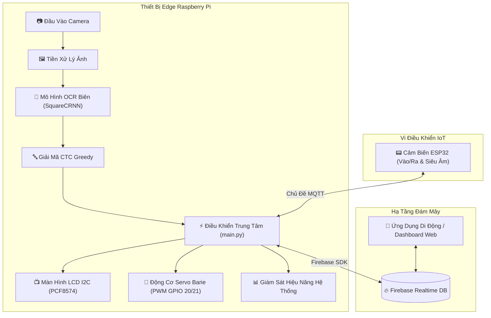

# 🚗 Hệ Thống Edge Computing OCR (Bãi Xe Thông Minh AIoT)

[](https://www.python.org/downloads/)
[](https://pytorch.org/)
[](https://opencv.org/)
[](https://firebase.google.com/)
[](https://mqtt.org/)
[](https://www.raspberrypi.com/)
[](LICENSE)

Hệ thống nhận dạng ký tự quang học (OCR) biển số xe và điều khiển barie tự động thời gian thực tại biên (Edge Node), được tối ưu hóa cho Raspberry Pi 4/5. Hệ thống kết hợp mô hình suy luận học sâu (PyTorch ResNet) chạy trực tiếp tại biên với Cơ sở dữ liệu thời gian thực Firebase Realtime Database và giao thức truyền thông điệp MQTT dành cho ứng dụng bãi xe thông minh và kiểm soát ra vào.

---

## 📐 Kiến Trúc Luồng Dữ Liệu IoT & Edge AI



---

## 🧠 Pipeline Xử Lý Edge AI

Pipeline nhận dạng ký tự quang học Edge AI chạy hoàn toàn cục bộ trên Raspberry Pi, không phụ thuộc vào API điện toán đám mây:

```
[Khung Ảnh BGR Thô] ➔ [Chuyển Ảnh Xám & Resize 128x128] ➔ [Chuẩn Hóa về (-1, 1)]
       ↓
[Mạng Xương Sống ResNet (Conv2d + BatchNorm + ReLU)]
       ↓
[Lớp Chú Ý Không Gian Self-Attention (Bản Đồ Năng Lượng Query-Key-Value)]
       ↓
[Gộp Trung Bình Thích Nghi Adaptive Average Pooling (1 x W)]
       ↓
[Mạng LSTM 2 Chiều 2 Lớp (Trích Xuất Đặc Trưng Chuỗi Sequences)]
       ↓
[Lớp Phân Loại Tuyến Tính (37 Lớp)] ➔ [Giải Mã CTC Greedy] ➔ "59H-333.33"
```

---

## ⚡ Tính Năng Nổi Bật

- **Nhận Dạng Ký Tự Biển Số Thời Gian Thực**: Suy luận mô hình PyTorch nhúng trực tiếp tại biên kết hợp thuật toán giải mã chuỗi CTC tối ưu.
- **Điều Khiển Barie Hai Chiều**: Tự động mở/đóng cổng vào và cổng ra thông qua các kênh điều chế độ rộng xung (PWM Servo).
- **Đồng Bộ Dữ Liệu Firebase Realtime DB**: Ghi nhận lượt xe ra/vào theo thời gian thực, tự động trừ tiền ví điện tử và tích hợp thanh toán mã QR.
- **Tuyến Truyền Tin MQTT Tốc Độ Cao**: Giao tiếp bất đồng bộ phi nghẽn với các vi điều khiển ngoại vi (ESP32).
- **Hiển Thị Tương Tác Qua Màn Hình LCD I2C**: Hiển thị trạng thái chỗ trống bãi xe và tin nhắn hướng dẫn cho tài xế.
- **Giám Sát Sức Khỏe Phần Cứng SoC**: Theo dõi thời gian thực tải CPU, dung lượng RAM và nhiệt độ chíp xử lý Raspberry Pi.
- **Chế Độ Giả Lập Môi Trường (Fallback)**: Cho phép chạy thử nghiệm và phát triển trên PC không có phần cứng Raspberry Pi.

---

## 📁 Cấu Trúc Thư Mục Dự Án

```
EDGE_NODE/
├── src/                          # Mã nguồn chính của ứng dụng
│   ├── __init__.py               # Khai báo gói Python
│   ├── main.py                   # Điều phối trung tâm & vòng lặp sự kiện
│   ├── model.py                  # Kiến trúc mạng PyTorch SquareCRNN
│   └── camera_ocr.py             # Mạch thu nạp ảnh camera & suy luận OCR
├── models/                       # Thư mục chứa trọng số mô hình PyTorch
│   └── best_square_ocr_pro.pth   # File trọng số huấn luyện (đặt tại đây)
├── config/                       # Cấu hình hệ thống
│   ├── config.py                 # Thông số cấu hình & sơ đồ chân GPIO
│   └── firebase-credentials.example.json # Mẫu file xác thực Firebase
├── docs/                         # Tài liệu hướng dẫn chi tiết
│   ├── SETUP.md                  # Hướng dẫn cài đặt nâng cao
│   └── API.md                    # Cấu trúc chủ đề MQTT & Schema dữ liệu
├── captures/                     # Thư mục lưu ảnh tạm thời
├── requirements.txt              # Danh sách thư viện Python phụ thuộc
├── QUICKSTART.md                 # Hướng dẫn khởi chạy nhanh
├── CONTRIBUTING.md               # Quy định đóng góp mã nguồn
├── LICENSE                       # Giấy phép MIT
└── README.md                     # Tài liệu giới thiệu dự án
```

---

## 🚀 Hướng Dẫn Cài Đặt & Triển Khai

### 1. Yêu Cầu Phần Cứng & Môi Trường
- Bo mạch Raspberry Pi 4 hoặc 5 chạy hệ điều hành **Raspberry Pi OS (64-bit)**.
- Python phiên bản 3.8 trở lên.
- Module Camera Raspberry Pi (CSI) hoặc Webcam cổng USB.
- Màn hình LCD 16x2 tích hợp mạch I2C PCF8574 & 2 động cơ Servo SG90/MG996R.

### 2. Cài Đặt Môi Trường Khởi Chạy
```bash
# Tải mã nguồn từ GitHub
git clone https://github.com/phanhuynhvando/EDGE_NODE.git
cd EDGE_NODE

# Tạo và kích hoạt môi trường ảo Python
python3 -m venv venv
source venv/bin/activate

# Cập nhật pip và cài đặt các thư viện phụ thuộc
pip install --upgrade pip
pip install -r requirements.txt
```

### 3. Cấu Hình Firebase & Trọng Số Mô Hình
1. Tải file khóa dịch vụ `.json` từ Firebase Admin SDK Console.
2. Sao chép file mẫu và dán thông tin xác thực của bạn:
   ```bash
   cp config/firebase-credentials.example.json config/firebase-credentials.json
   ```
3. Sao chép file trọng số mô hình `best_square_ocr_pro.pth` đã huấn luyện vào thư mục `models/`:
   ```bash
   cp /path/to/best_square_ocr_pro.pth models/
   ```

### 4. Khởi Chạy Hệ Thống
```bash
# Chạy chương trình điều khiển chính
python3 src/main.py

# Khởi chạy tùy chỉnh tham số MQTT Broker
python3 src/main.py --broker 192.168.1.100 --port 1883
```

---

## ⚙️ Cấu Hình Chạy Ngầm Systemd Service

Đảm bảo hệ thống Edge Node tự động khởi chạy cùng hệ điều hành khi bật nguồn Raspberry Pi bằng cách cấu hình dịch vụ `systemd`:

1. Tạo file cấu hình dịch vụ `/etc/systemd/system/edge-node.service`:

```ini
[Unit]
Description=Hệ Thống AIoT Edge Node OCR Bãi Xe
After=network.target mqtt.service

[Service]
Type=simple
User=pi
WorkingDirectory=/home/pi/EDGE_NODE
Environment="PATH=/home/pi/EDGE_NODE/venv/bin"
ExecStart=/home/pi/EDGE_NODE/venv/bin/python3 /home/pi/EDGE_NODE/src/main.py
Restart=always
RestartSec=5

[Install]
WantedBy=multi-user.target
```

2. Kích hoạt và khởi chạy dịch vụ:
```bash
# Nạp lại cấu hình daemon
sudo systemctl daemon-reload

# Kích hoạt dịch vụ khởi động cùng hệ thống
sudo systemctl enable edge-node.service

# Khởi chạy dịch vụ ngay lập tức
sudo systemctl start edge-node.service

# Kiểm tra trạng thái hoạt động của dịch vụ
sudo systemctl status edge-node.service
```

---

## 📌 Sơ Đồ Chân Hardware & Thông Số Kỹ Thuật

| Thiết Bị / Linh Kiện | Cổng Giao Tiếp / Chân GPIO | Chức Năng Hoạt Động |
| :--- | :--- | :--- |
| **Động Cơ Servo Cổng Vào** | GPIO 20 (PWM) | Điều khiển đóng/mở barie lối vào |
| **Động Cơ Servo Cổng Ra** | GPIO 21 (PWM) | Điều khiển đóng/mở barie lối ra |
| **Màn Hình LCD 16x2 I2C** | I2C (SDA=GPIO2, SCL=GPIO3, Địa chỉ 0x27) | Hiển thị thông tin & hướng dẫn cho tài xế |
| **Module Camera** | Chuẩn CSI Ribbon / USB Camera | Chụp và thu nạp hình ảnh biển số xe |

---

## 📜 Giấy Phép

Dự án được phân phối dưới giấy phép **MIT License** - xem file [LICENSE](LICENSE) để biết thêm thông tin chi tiết.

---

## 👨‍💻 Tác Giả

**Phan Huỳnh Văn Đô**  
GitHub: [@phanhuynhvando](https://github.com/phanhuynhvando)
