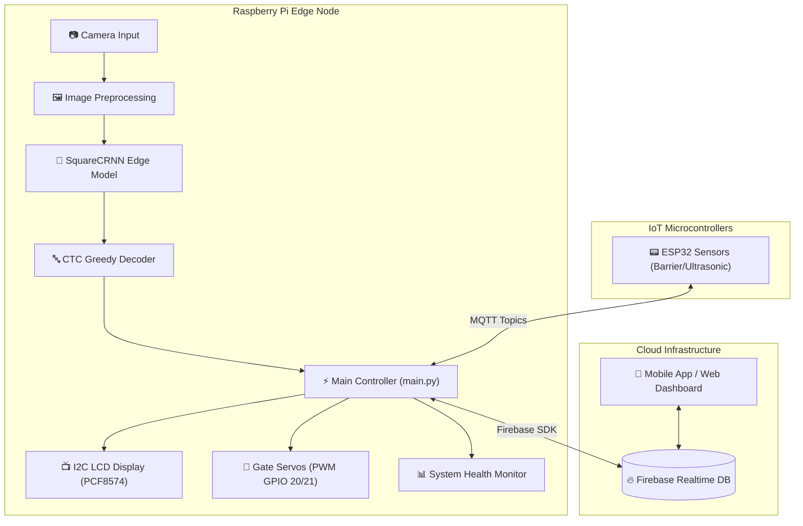

# 🚗 Edge Node OCR System (AIoT Smart Parking)

[](https://www.python.org/downloads/)
[](https://pytorch.org/)
[](https://opencv.org/)
[](https://firebase.google.com/)
[](https://mqtt.org/)
[](https://www.raspberrypi.com/)
[](LICENSE)

An intelligent, real-time Optical Character Recognition (OCR) and barrier control edge node built for Raspberry Pi 4/5. The system integrates deep learning inference at the edge with Firebase Realtime Database and MQTT messaging for smart parking and access control applications.

---

## 📐 System Architecture



---

## 🧠 Edge AI Pipeline

The Edge AI pipeline runs locally on the Raspberry Pi without requiring cloud API calls for OCR:

```
[Raw BGR Frame] ➔ [Grayscale & 128x128 Resize] ➔ [Normalize to (-1, 1)]
       ↓
[ResNet Residual Backbone (Conv2d + BatchNorm + ReLU)]
       ↓
[Spatial Self-Attention Layer (Query-Key-Value Energy Maps)]
       ↓
[Adaptive Average Pooling (1 x W)]
       ↓
[2-Layer Bidirectional LSTM (Sequential Feature Extraction)]
       ↓
[Linear Classifier (37 Classes)] ➔ [Greedy CTC Decoding] ➔ "59H-333.33"
```

---

## ⚡ Features

- **Real-Time License Plate OCR**: Embedded PyTorch inference with optimized CTC sequence decoding.
- **Bi-Directional Gate Control**: Autonomous entry/exit barrier control driven by servo PWM channels.
- **Firebase Synchronization**: Real-time logging of parking sessions, automatic wallet deductions, and QR code payments.
- **MQTT Event Bus**: High-speed, non-blocking telemetry communication with microcontrollers (ESP32).
- **Interactive LCD Feedback**: Hardware status display showing active parking availability and greeting instructions.
- **SoC Health Monitoring**: Live tracking of CPU load, RAM usage, and SoC thermal status.
- **Hardware Fallback**: Graceful fallback to console emulation when running off-Pi for development.

---

## 📁 Repository Structure

```
EDGE_NODE/
├── src/                          # Application source code
│   ├── __init__.py               # Package metadata
│   ├── main.py                   # Master orchestrator & event loops
│   ├── model.py                  # PyTorch SquareCRNN architecture
│   └── camera_ocr.py             # Camera capture & inference module
├── models/                       # Trained PyTorch checkpoints
│   └── best_square_ocr_pro.pth   # Weights file (place here)
├── config/                       # System configuration
│   ├── config.py                 # Central parameters & pinouts
│   └── firebase-credentials.example.json
├── docs/                         # Extended documentation
│   ├── SETUP.md                  # Comprehensive installation guide
│   └── API.md                    # MQTT topics & schema reference
├── captures/                     # Temporary frame captures
├── requirements.txt              # Python dependencies
├── QUICKSTART.md                 # Quick launch guide
├── CONTRIBUTING.md               # Contribution guidelines
├── LICENSE                       # MIT License
└── README.md                     # Project documentation
```

---

## 🚀 Quickstart Guide

### 1. Prerequisites
- Raspberry Pi 4 or 5 running **Raspberry Pi OS (64-bit)**.
- Python 3.8 or higher.
- Raspberry Pi Camera Module or USB Webcam.
- PCF8574 I2C 16x2 LCD Display & 2x SG90/MG996R Servo Motors.

### 2. Environment Setup
```bash
# Clone the repository
git clone https://github.com/phanhuynhvando/EDGE_NODE.git
cd EDGE_NODE

# Create and activate virtual environment
python3 -m venv venv
source venv/bin/activate

# Install dependencies
pip install --upgrade pip
pip install -r requirements.txt
```

### 3. Firebase & Model Configuration
1. Obtain your Firebase Admin SDK service account credentials `.json` file.
2. Copy the template and paste your credentials:
   ```bash
   cp config/firebase-credentials.example.json config/firebase-credentials.json
   ```
3. Copy your trained PyTorch checkpoint `best_square_ocr_pro.pth` into `models/`:
   ```bash
   cp /path/to/best_square_ocr_pro.pth models/
   ```

### 4. Running the System
```bash
# Run the main orchestrator
python3 src/main.py

# Optional: Run with custom MQTT broker host
python3 src/main.py --broker 192.168.1.100 --port 1883
```

### 5. Auto-Start Service (Systemd Daemon)
To run the Edge Node automatically on system boot, install the systemd unit file:

```ini
# /etc/systemd/system/edge-node.service
[Unit]
Description=AIoT Edge Node OCR System
After=network.target mqtt.service

[Service]
Type=simple
User=pi
WorkingDirectory=/home/pi/EDGE_NODE
Environment="PATH=/home/pi/EDGE_NODE/venv/bin"
ExecStart=/home/pi/EDGE_NODE/venv/bin/python3 /home/pi/EDGE_NODE/src/main.py
Restart=always
RestartSec=5

[Install]
WantedBy=multi-user.target
```

Enable and start the service:
```bash
sudo systemctl daemon-reload
sudo systemctl enable edge-node.service
sudo systemctl start edge-node.service
```

---

## 📌 Hardware Pinout & Specs

| Component | Interface / Pin | Function |
| :--- | :--- | :--- |
| **Input Servo Motor** | GPIO 20 (PWM) | Controls entrance barrier gate |
| **Output Servo Motor** | GPIO 21 (PWM) | Controls exit barrier gate |
| **16x2 LCD Display** | I2C (SDA=GPIO2, SCL=GPIO3, Addr=0x27) | User visual status display |
| **Camera Module** | CSI Ribbon / USB Camera | License plate image acquisition |

---

## 📜 License

This project is licensed under the MIT License - see the [LICENSE](LICENSE) file for details.

---

## 👨‍💻 Author

**Phan Huỳnh Văn Đô**  
GitHub: [@phanhuynhvando](https://github.com/phanhuynhvando)
